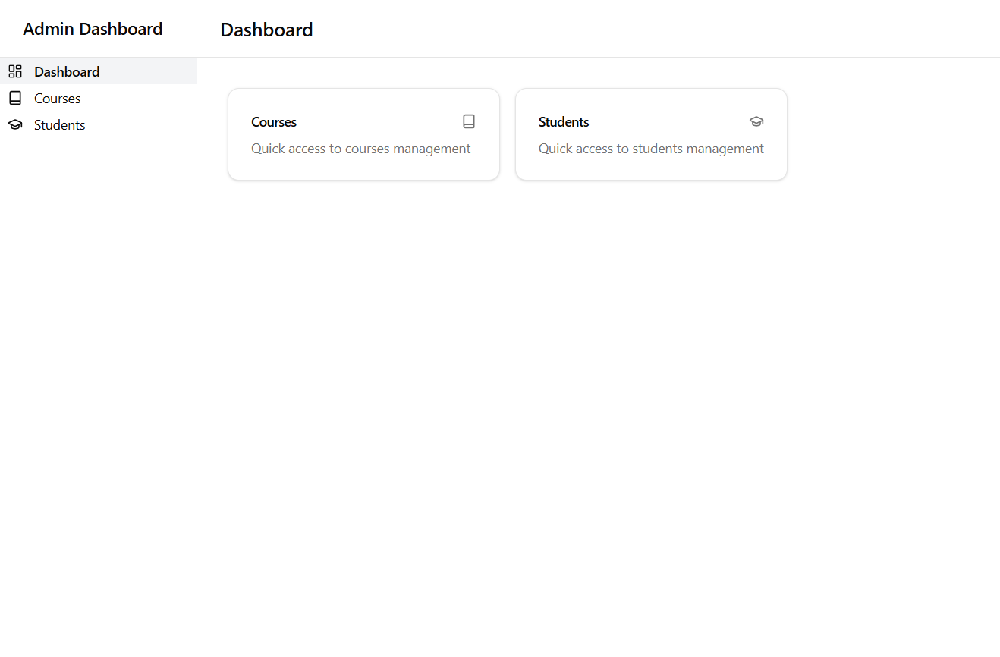

# Enrollment Management System

A web-based application designed to manage enrollments for students and courses. The system enables administrators to handle student records, course details, and enrollment processes with ease. Built using **Django** for the backend and integrated with a REST API for seamless communication, the system ensures robust and scalable management of educational data.



## Features

- **Students Management**: Create, update, and retrieve student records.
- **Courses Management**: Manage course details, including maximum capacity and schedules.
- **Enrollments**: Enroll students in courses, disenroll them, and track their enrollment history.
- **Validation**:
  - Prevent duplicate enrollments for the same student and course.
  - Ensure course capacity is not exceeded.
  - Disallow course deletion if active enrollments exist.

## Main Rules

1. **Unique Enrollment**: A student cannot be enrolled in the same course more than once.
2. **Capacity Limitation**: A course cannot have more students enrolled than its defined maximum capacity.
3. **Course Deletion Restriction**: A course cannot be deleted if it has any active enrollments.
4. **Validation on Disenrollment**: When disenrolling a student from a course, proper validation ensures no orphaned data exists.

## Tech Stack

- **Backend**: Python, Django, Django REST Framework
- **Frontend**: Typescript, React with Vite
- **Database**: SQLite

## Installation

1. Clone the repository:
   ```bash
   git clone https://github.com/your-username/enrollment-management.git
   cd enrollment-management
   ```
2. Install backend dependencies:
  ```bash
  pip install -r requirements.txt
  ```
3. Run migrations:
  ```bash
  python manage.py migrate
  ```
4. Start the backend development server::
  ```bash
  python manage.py runserver
  ```
5. Navigate to the frontend directory and install frontend dependencies:
  ```bash
  cd frontend
  pnpm i && pnpm dev
  ```

## Running tests

Run the following command to execute the test suite:
```bash
python manage.py test
```